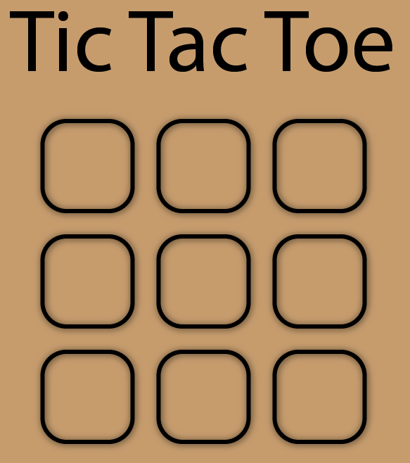

# TicTacToe-SDL

TicTacToe game written in C++ using SDL2

</img>

This is the first time that I'm coding something with SDL2 and I just started to learn C++ so don't expect too much. 
This is just a project to learn a bit.

# Installation

Download the latest release from the [Releases tab](https://github.com/sorpdev/TicTacToe-SDL/releases) on GitHub

# Libraries
- [SDL2](https://github.com/libsdl-org/SDL)
- [SDL2_image](https://github.com/libsdl-org/SDL_image)
- [SDL2_ttf](https://github.com/libsdl-org/SDL_ttf)
